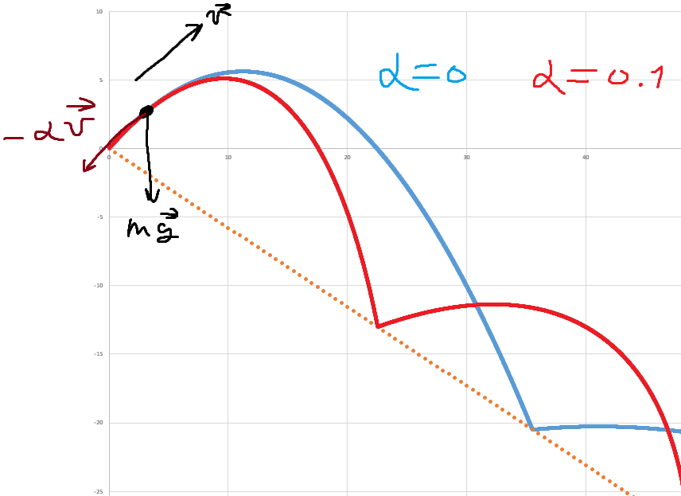
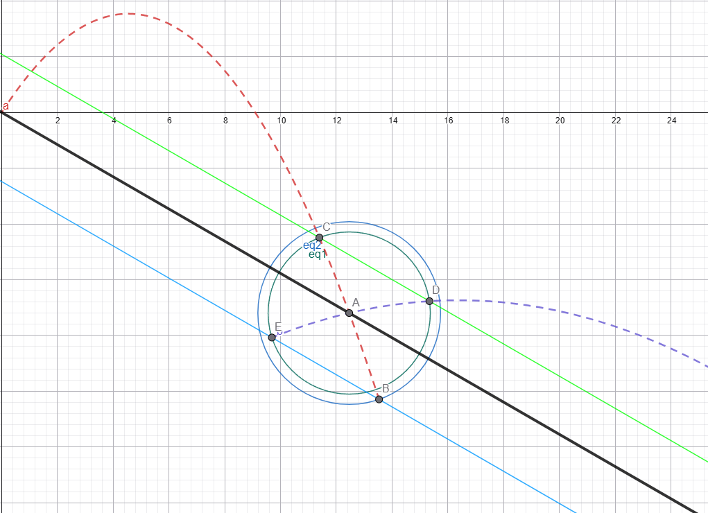

## languages:
+ [ru](#ru)


# ru
## цели проекта
- [x] реализовать калькулятор для физических задач
- [ ] реализовать графику
- [ ] реализовать универсальный аппарат ждя симуляций


# численные методы
Данный проект реализвует следующие физические модели при помощи численного решения дифференциальных уравнений:
+ [задача двух тел + трение о атмосферу](#задача-двух-тел)
+ [отскок тела от поверхности + трение о воздух](#отскок)
+ идеальный газ (не доделанно)
+ реальный маятник (не доделанно)


# задача двух тел
## описание задачи и решение


Пускай точечная масса M ($M >> m$) покоится в начале координат. \
Запишим закон всемирного тяготения Ньютона в векторном виде: 

$$\bar{f}_г = -\frac{GMm}{||\bar{r}||^3}\bar{r}$$

С учётом силы трения $\bar{f}_{сопр}=-\alpha \bar{v}$ запишем второй закон ньютона: 

$$m\ddot{r} = - \frac{GMm}{||\bar{r}||^3}\bar{r} - \alpha \dot{r}$$

После замены $g = GM$, $a = \frac{\alpha}{m}$ получим в проекциях на оси: 

$$\ddot{x} = -\frac{gx}{(x^2+y^2)^{3/2}} - a\dot{x} \ ,$$ $$\ddot{y} = -\frac{ky}{(x^2+y^2)^{3/2}} - a\dot{y}$$

с учётом того, что: 

$$\frac{d}{dt}f(t) = \lim_{\delta \to 0}\frac{f(t+\delta) - f(t)}{\delta}$$

$$\frac{d^2}{dt^2}f(t) = \lim_{\delta \to 0}\frac{f(t+\delta) - 2f(t) + f(t-\delta)}{\delta^2}$$

получим для одной из координат: 

$$\frac{x(t+\delta) - 2x(t) + x(t-\delta)}{\delta^2} = -\frac{gx(t)}{(x^2(t)+y^2(t))^{3/2}} - \alpha\frac{x(t+\delta)-x(t)}{\delta}$$

откуда: 

$$x(t+\delta) =  \frac{1}{1+\alpha\delta} \left[ x(t)\cdot \left( 2-\frac{g\delta^2}{(x^2(t)+y^2(t))^{3/2}} -\alpha\delta \right) - x(t-\delta)\right]$$


## описание программы
```C
FILE* cords = fopen("cords.txt", "w");
if (cords == NULL) {
	perror("Error opening file");
	return 1;
}
```
`cords.txt` -- файл, в который записываются координаты в каждый момент времени

___
```C
float x_1 = 100, y_1 = 0, d = 0.05f, g = 100, a = 0.0004f, f = M_PI / 2, v = 1, x, y, x_2, y_2;
x = x_1 + v*d * cos(f);
y = y_1 + v*d * sin(f);
```
+ `x, y` -- текущее положение тела
+ `x_1, y1` -- предыдущее положение тела
+ `x_2, y_2` -- хендлер для новых координат тела
+ `f` -- угол броска (в радианах)
+ `v` -- начальная скорость тела
+ `g, a` -- параметры траектории, описанные в решении

___
```C
for (int i = 0; i < 25000; i++) {
	x_2 = (x * (2 - g*d*d / pow(x*x + y*y, 1.5) + a*d) - x_1) / (1 + a*d);
	y_2 = (y * (2 - g*d*d / pow(x*x + y*y, 1.5) + a*d) - y_1) / (1 + a*d);

	fprintf(cords, "%f %f\n", x_2, y_2);

	x_1 = x, y_1 = y;
	x = x_2, y = y_2;
}
```
на протяжении 25000 итерация происходят вычисления положения по полученной ранее формуле, затем координаты записываются в файл


# отскок
## описание задачи и решение
Графики траекторий при различных коэффициентах аэродинамического сопротивления


Пускай точечную массу m бросили из начала координат с начальной скоростью $v_0$ под углом $\varphi_0$ к горизонту. \
На тело действуют сила тяжести $\bar{f}_{тяж} = m\bar{g}$ и сила аэродиномического сопротивления 
$\bar{f}_{сопр}=-\alpha \bar{v}$. Запишем второй закон ньютона:

$$m\ddot{r} = m\bar{g} - \alpha \dot{r}$$

после замены $a = \frac{\alpha}{m}$ получим ОДУ:

$$\ddot{r} + a \dot{r} - \bar{g} = 0$$

оно имеет решение:

$$x(t) = x_0 + \frac{v_0\cdot cos(\varphi_0)}{a}\cdot \left( 1 - e^{-at} \right)$$

$$y(t) = y_0 + \left( \frac{v_0\cdot sin(\varphi_0)}{a} + \frac{g}{a^2}\right) \cdot \left( 1 - e^{-at} \right) - \frac{gt}{a}$$

Но в рамках данной симуляции даное решение бесполезно, поскольку оно будет работать вплоть до первого отскока, а потом придётся заново высчитывать $(x_0, y_0), v_0$, а потом ещё и придётся высчитывать $\varphi_0$ после отскока.

В рамках данной симуляции нам удобнее хранить несколько предыдущих положений точки, а не их + скорости, так что выведем метод трансляции координат при отскоке:

с учётом того, что: 

$$\frac{d}{dt}f(t) = \lim_{\delta \to 0}\frac{f(t+\delta) - f(t)}{\delta}$$

$$\frac{d^2}{dt^2}f(t) = \lim_{\delta \to 0}\frac{f(t+\delta) - 2f(t) + f(t-\delta)}{\delta^2}$$

получим рекурсивную форму:

$$\frac{x(t+\delta) - 2x(t) + x(t-\delta)}{\delta^2} + a\cdot\frac{x(t+\delta) - x(t)}{\delta} = 0$$

$$\frac{y(t+\delta) - 2y(t) + y(t-\delta)}{\delta^2} + a\cdot\frac{y(t+\delta) - y(t)}{\delta} - g= 0$$

решая, получим:

$$x(t+\delta) = \frac{1}{1+a\delta}\cdot\left( x(t)\cdot (2 - a\delta) - x(t-\delta) \right)$$

$$y(t+\delta) = \frac{1}{1+a\delta}\cdot\left( y(t)\cdot (2 - a\delta) - y(t-\delta) - g\delta^2\right)$$



> geogebra обозвала точки в том порядке, что они на рисунке, что и не очень удобно, но это (возможно) будет решенно через несколько обновлений

Пускай нам известно положение точки $C(x_1, y_1)$ в некоторый момент времени, и известно, что спустя время $\delta \to 0$ оно оказаловсь в точке $B(x, y)$, находящейся с обратной стороны от поверерхности. Тогда для симуляции отражения нам необходимо вычислить точку $A(x_2, y_2)$ пересечения -- её можно аппроксимировать, как пересечение прямой CB и поверхности:

$$y_2 = y_1 + \frac{y_1-y}{x_1-x}\cdot(x_2 - x_1)$$

$$y_2 = x_2\cdot tan(\beta)$$

откуда:

$$ x_2 = \frac{y - \frac{y_1 - y}{x_1 - x} \cdot x }{tan(\beta) - \frac{y_1 - y}{x_1 - x}}$$

$$y_2 = x_2 \cdot tan(\beta)$$

По закону отражения: угол падения равен углу отражения. Тогда требуется восстановить срединный перпенжикуляр в точке касания, и построить угол отражения так, чтобы срединный перпендикуляр был биссектрисой. Это условие выполняется в равностороннем треугольнике. Построить равносторонний треугольник можно так: \
Построим из точки A окружность радиуса AC. проведя из точки C прямую CD, параллельную первоначальной поверхности. Точка $D(x_3, y_3)$ пересечения прямой и окружности -- и есть искомая точка отражения. 
> Данная аппроксимация даёт большую погрешность при бошьших $\delta$, но при $\delta \to 0$ погрешность незначительна

По аналогии получим точку E. Тогда $E(x_4, y_4)$ -- точка мнимого предыдущего положения, а D -- точка текущего положения, и уже из них можно строить симуляцию.

Рассчёты координат D:

$$ y_3 = y_1 +(x_3-x_1)\cdot tan(\beta)$$

$$(x_3-x_2)^2 + (y_3-y_2)^2 = (x_1-x_2)^2 + (y_1-y_2)^2$$

Решая, получим:

$$x_3 = cos^2(\beta) \cdot \left( x_1\cdot tan^2(\beta) + 2\cdot(y_2-y_1)\cdot tan(\beta) + 2x_2 -x_1\right)$$

$$y_3 = y_1 + (x_3 - x_1) \cdot tan(\beta)$$

$$x_4 = cos^2(\beta) \cdot \left( x\cdot tan^2(\beta) + 2\cdot(y_2-y)\cdot tan(\beta) + 2x_2 -x_1\right)$$

$$y_4 = y + (x_4 - x) \cdot tan(\beta)$$


## описание программы
```C 
float curve(float x, float b) {
	return x * tan(b);
}
```
Здесь сделан задел на будущее, где кривая -- не ровная плоскость, а кривая поверхность, наклон которой зависит от положения

___
```C
FILE* file = fopen("cords.txt", "w");
if (file == NULL) {
	perror("Error opening file");
	return 1;
}
```
В файл `cords.txt` записываются координаты тела в каждый момент вермени выполнения программы, а затем и точки кривой

___
```C
float x_1 = 0, y_1 = 0, d = 0.001f, a = 0.1f, f = M_PI/4, b = -M_PI/6, v = 15, g = 10, x_2, y_2, x, y, x_3, y_3, x_4, y_4;
x = x_1 + v * d * cos(f);
y = y_1 + v * d * sin(f);
...
int bounces = 0, i = 0;
```
+ `(x_1, y_1)` -- предыдущее положение тела
+ `(x, y)` -- текущее положение тела
+ `(x_2, y_2)` -- хендлер для новых координат И точки пересечения
+ `(x_3, y_3)`, `(x_4, y_4)` -- хендлеры для транслированных координат после отскока
+ `d` -- шаг симуляции
+ `a` -- коэффициент сопротивления
+ `f` -- угол броска
+ `b` -- угол плоскости
+ `v` -- начальная скорость
+ `g` -- ускорение свободного падения
+ `bounces` -- число отскоков
+ `i` -- число итераций

___
```C
while ((y >= curve(x, b)) && (i < 10000)) {
	i++;
	x_2 = (x * (2 + a * d) - x_1) / (1 + a * d);
	y_2 = (y * (2 + a * d) - y_1 - g * d * d) / (1 + a * d);

	y_1 = y;
	y = y_2;
	x_1 = x;
	x = x_2;

	if (y <= curve(x, b)) {
		bounces++;

		if (b != 0) {
			// intersection
			x_2 = (y - (y_1 - y) * x / (x_1 - x)) / (tan(b) - (y_1 - y) / (x_1 - x));
			y_2 = x_2 * tan(b);

			x_3 = cos(b)*cos(b) * (x_1*tan(b)*tan(b) + 2*(y_2-y_1)*tan(b) + 2*x_2 - x_1);
			y_3 = y_1 + (x_3-x_1)*tan(b);

			x_4 = cos(b)*cos(b) * (x*tan(b)*tan(b) + 2*(y_2-y)*tan(b) + 2*x_2 - x);
			y_4 = y + (x_4-x) * tan(b);

			x = x_3, y = y_3;
			x_1 = x_4, y_1 = y_4;
		}
		else if (b == 0) {
			y_1 = -y_1;
			y = -y;
		}
	}

	fprintf(file, "%f %f\n", x, y);
}
```
В цикле производится вычисление траектории по высшеописанному алгоритму, а координаты записываются в файл

___
```C
// line
for (float j = 0; j < x; j += 0.5f) {
	fprintf(file, "%f %f\n", j, j * tan(b));
}
```
В файл записываются координаты плоскости
