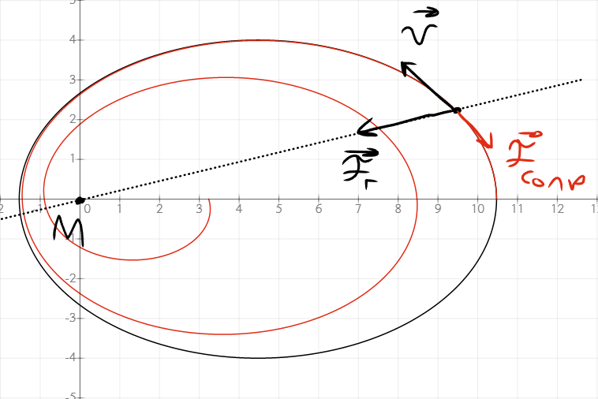

# численные методы
Данный проект реализвует следующие физические модели при помощи численного решения дифференциальных уравнений:
+ задача двух тел + трение о атмосферу
+ отскок тела от поверхности + трение о воздух
+ идеальный газ (не доделанно)
+ реальный маятник (не доделанно)

# задача двух тел

Пускай точечная масса M ($M >> m$) покоится в начале координат. \
Ззапишим закон всемирного тяготения Ньютона в векторном виде:
$$ \bar{f}_г = -\frac{GMm}{||\bar{r}||^3}\bar{r}$$

С учётом силы трения $\bar{f}_{сопр}=-\alpha \bar{v}$ запишем второй закон ньютона:
$$m\ddot{r} = - \frac{GMm}{||\bar{r}||^3}\bar{r} - \alpha \dot{r}$$

После замены $k = GM$, $a = \frac{\alpha}{m}$ получим в проекциях на оси:
$$\ddot{x} = -\frac{kx}{(x^2+y^2)^{3/2}} - a\dot{x} \ ,$$ $$\ddot{y} = -\frac{ky}{(x^2+y^2)^{3/2}} - a\dot{y}$$

с учётом того, что:
$$\frac{d}{dt}f(t) = \lim_{\delta \to 0}\frac{f(t+\delta) - f(t)}{\delta}$$
$$\frac{d^2}{dt^2}f(t) = \lim_{\delta \to 0}\frac{f(t+\delta) - 2f(t) + f(t-\delta)}{\delta^2}$$

получим для одной из координат:
$$\frac{x(t+\delta) - 2x(t) + x(t-\delta)}{\delta^2} = -\frac{kx(t)}{(x^2(t)+y^2(t))^{3/2}} - \alpha\frac{x(t+\delta)-x(t)}{\delta}$$

откуда:
$$x(t+\delta) =  \frac{1}{1+\alpha\delta} \left[ x(t)\cdot \left( 2-\frac{k\delta^2}{(x^2(t)+y^2(t))^{3/2}} -\alpha\delta \right) - x(t-\delta)\right] $$
